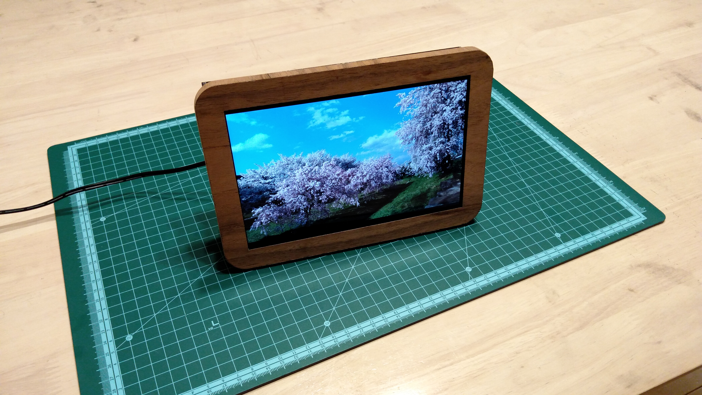

# phoseum
Photo and Video slideshow with Raspberry Pi.

This is the repository containing software part and some notes of my hobby project for building Digital Photo Frame with Raspberry Pi.

# Features

* Use a Google Photos album as the playlist
* Some control for the slideshow by GPIO signals
  * Play next
  * Play prev
  * Mute/Unmute
  * Pause/Resume
* Periodical playlist updates and refreshes
* Auto sleep at night, wakeup at morning
* Quota based local media cache retention

# Hardware Construction Log

[Hardware Construction Log](./docs/hardware.md)

# License

[MIT](./LICENSE)
