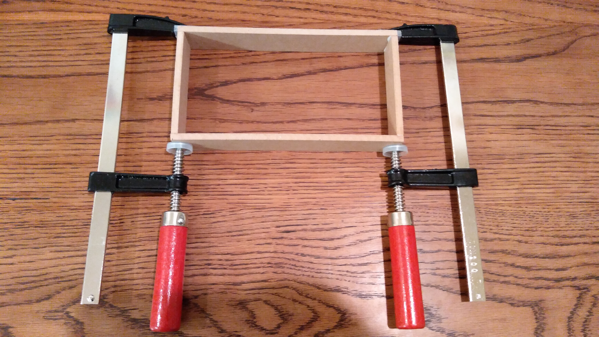
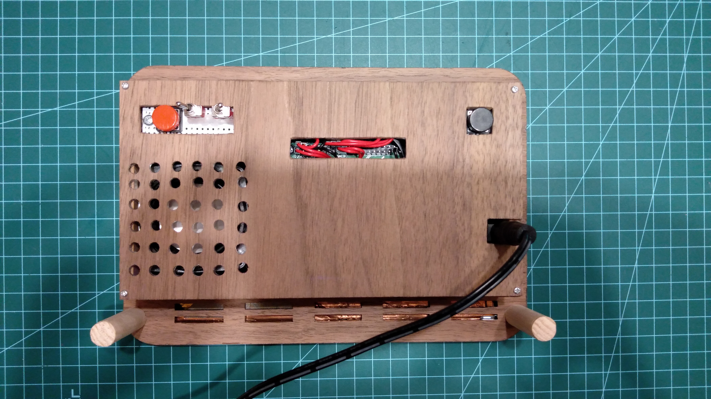

# Hardware

This is the log of hardware construction that I did to run this application on Raspberry Pi based original digital photo frame (DPF).

# Design

The DPF is consists of following parts.

* 8-inch LCD display
* Raspberry Pi 3B as the controller
* Speaker for playing sound of videos

Also it has following physical buttons and switches to control player.

* Tact switch for "play next"
* Tact switch for "play previous"
* Toggle switch for "pause" and "resume"
* Toggle switch for "mute" and "unmute"

# Controller

I selected Raspberry Pi 3B as the controller just because it was the latest Pi edition that I could purchase from store (3B+ was totally out of stock in all the places!).

# Display

I used [WIMAXIT 8-inch HDMI display](https://www.amazon.co.jp/gp/product/B077SLPKB6) for the display unit.
It is equipped with display controller board that supports HDMI input (without sound) and I used it almost as-is.
The display panel is sandwiched by simple frame parts and is connected with the controller board by ribbon cable.

# Speaker

For the speaker I wasn't really needed high quality sound since I was thinking it as just an auxiliary functionality compared to displaying images and videos.
Hence I used daiso's speaker that you can buy in 300 yen including amplifier.
It is stereo speaker but since the case built on display unit cannot contain two of them, I just used one of them and amplifier board by decomposing and desoldering one of them off the board.

I also replaced its power supply cable from USB to simple wires so that it can get power supply from Pi's 3.3V pin.

It connects to the display controller board by standard stereo audio cable and jack.
I ripped off some coating around the jack for saving space.

# Power Supply

As guided in [RaspberryPi's document](https://www.raspberrypi.org/documentation/hardware/raspberrypi/power/README.md), RaspberryPi 3B recommends 2.5A for PSU capacity and peripheral current draw is limited to 1.2A.
The 8-inch LCD display requires 5V/2A input which is way more than Pi's draw limit, and is also too tight to supply from 5V/3A microUSB cable.
For stable power supply, I bought [5V/4A 2.1mm DC jack](http://akizukidenshi.com/catalog/g/gK-05148/) and the [AC adaptor](http://akizukidenshi.com/catalog/g/gM-06238/) to achieve 4A power supply for both Pi and display with single cable.

A typical USB cable has 4 wires where two of them (red and black) are for power supply. We need only those wires for display unit power supply so cut and leave the others.

With a tiny piece of universal board I soldered DC jack and ripped microUSB cable along with another pair of wires for Pi's power supply as below.

# Electronics

So the circuit built for this is fairly easy and straightforward.

I installed buttons and switches on the pieces of universal board and made their foot from wood to stand them on.

## HDMI cable

In terms of wiring, one of the most difficult thing was to fit all cables within the case with limited capacity.
HDMI connector was the biggest headache because of its space-consuming connector size.

To address this problem I used [Angled compact HDMI connector](https://www.amazon.co.jp/gp/product/B071P93F3S). However, its equipped cable was broken and malfunctioning so I had to buy a spare [Ribbon cable](https://www.amazon.co.jp/gp/product/B07SR9H8V2) as well.

Now all the cables and connectors fits in the case.

# Case

I reused the most part of the case equipped with the display unit.
The only remaining thing to take care of is, the case to enclose Pi and the display controller.

I built a very simple enclosure from MDF boards like below (putting them togather with glue):

The back side cover was made out of acrylic panel and was supposed to be transparent to see inside. However I changed my plan by cracking it while processing holes for buttons and power cable, so finally it had also covered by decoration seal.

# Decoration

I wanted to make it look like that it was made from woods which is actually mix of something wood-ish, acrylic and MDF board.
There are tons of such decoration seals in the store but it looked like [樹のシート](https://www.amazon.co.jp/パネフリ工業-ビッグウィル樹のシートウォールナット材A3判-420X297mm-1枚入/dp/B00JH50IHE) is the best (and expensive). It's made of sliced real wood and it doesn't only look like a real wood but also feel like a real wood.

# Assembling

All that remains is assembling. I mainly used hot glue and double-sided tape to put parts togather.

## Floating screw head

One of the points that had to fix was the floating screw head.
As you can see in below pictures the original screw holes are not enough wide to embed whole head of screw making it to look ugly and obstacle to place decoration seal.

I drilled a bit wider gap on the both sides to embed the whole body of screws and nuts.

## Spacing between Pi and display controller

For spacing and insulation I put spacer and acrylic panel between Pi and display controller board.

## Installation on display frame

With double-sided tape and hot glue.

## Enclosure adhesion

Simply by glue.

# Final look

So this is how it look like in the end.
I really liked its wood-taste and the compact body!

I've actually made an another version of back panel with 3D printer but didn't used it since I liked the above one much.

